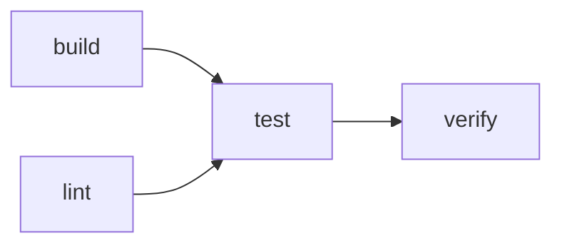

# upmd

<p align="center">
  
</p>

<p align="center">Run Markdown code blocks interactively in your terminal.</p>

<p align="center">
  <a href="https://github.com/rezigned/upmd/releases/latest"></a>
  <a href="LICENSE"></a>
  <a href="https://github.com/rezigned/upmd/actions/workflows/ci.yml"></a>
  <a href="https://github.com/rezigned/upmd/releases"></a>
</p>

<p align="center">
  
</p>

`upmd` runs code blocks directly from Markdown in a real terminal, keeping commands, context, and output together.

## What it does

- Opens a file, reads from stdin, or lets you browse Markdown files in a directory.
- Renders the document and keeps its code blocks, output, and terminal sessions together.
- Runs one block or a whole document from the TUI, the lightweight CLI, or CI.
- Carries exported shell variables and working-directory changes into the next block. Python, Go, Rust, and TypeScript can opt into experimental state capture.
- Lets you change runners, arguments, environment variables, themes, transparency, and key bindings.

## Installation

**Shell installer (macOS and Linux)**

```bash
curl --proto '=https' --tlsv1.2 -LsSf https://github.com/rezigned/upmd/releases/latest/download/upmd-installer.sh | sh
```

**Homebrew (macOS)**

```bash
brew install rezigned/tap/upmd
```

**Windows and manual downloads:** Download an archive and checksum from the [latest release](https://github.com/rezigned/upmd/releases/latest). Prebuilt binaries are available for macOS (Apple Silicon and Intel), Linux (x86_64 and ARM64), and Windows (x86_64).

**From source** — requires Rust 1.82 or newer:

```bash
git clone https://github.com/rezigned/upmd.git
cd upmd
cargo install --path .
```

## Quick start

```bash
# Browse Markdown files under the current directory
upmd

# Browse Markdown files under another directory
upmd ./docs

# Open one file in the TUI
upmd README.md

# Read Markdown from stdin
curl -s https://raw.githubusercontent.com/rezigned/upmd/main/README.md | upmd

# Open the lightweight CLI
upmd --cli README.md

# Execute every block without prompts
upmd --cli --all --yes DEMO.md

# Select a named or numbered block
upmd README.md --block setup
upmd README.md -b 3

# Select and immediately execute one block
upmd README.md --block setup --yes
```

When stdin is an interactive terminal and no file is supplied, `upmd` opens the current-directory file picker. Piped stdin remains Markdown input.

## Command-line reference

```text
Usage: upmd [OPTIONS] [FILE]

Arguments:
  [FILE]  Markdown file or directory. Omit to browse the current directory.

Options:
      --all                  Auto-advance through all code blocks
      --cli                  Use the lightweight CLI instead of the full-screen TUI
  -d, --working-dir <DIR>    Working directory for code execution
  -y, --yes                  Run without confirmation; use with --all or --block
      --theme <THEME>        Syntax-highlight theme
      --capture-state        Enable experimental non-shell state capture
  -b, --block <NAME|ID>      Select a named or numbered code block
      --dump-default-config  Print every default config key and exit
      --transparent          Use the terminal's default background
      --tick-rate <MS>       UI refresh interval in milliseconds
  -h, --help                 Print help
  -V, --version              Print version
```

Run `upmd --help` for the authoritative help generated by the installed version.

## File picker

Run `upmd` with a directory to browse its Markdown files. With no arguments, an interactive terminal starts the picker in the current directory; piped stdin is treated as Markdown instead.

The picker searches recursively, filters as you type, and shows a bounded syntax-highlighted preview. An unreadable entry does not stop the scan. In the TUI, press `f` to reopen the picker beside the active document.

## TUI shortcuts

Press `?` inside upmd for searchable help. For the full default keymap, see [`src/apps/config.toml`](src/apps/config.toml).

| Key | Context | Action |
|---|---|---|
| `up` / `k`, `down` / `j` | Menu | Move between blocks |
| `Enter` | Home or CLI | Run selected block |
| `/` | Home | Search document text |
| `ctrl-g` | Home | Filter and jump to a block |
| `o` | Home | Open full output view |
| `i` | Home | Enter input mode for the selected running block |
| `ctrl-o` | Input or output | Return to Home |
| `z` | Home | Toggle zen mode |
| `c` | Home | Toggle table of contents |
| `?` | Home | Open keymap help |
| `q` / `ctrl-c` | Home or CLI | Quit |

### Full output and interactive mouse support

Press `o` on the selected block to open its terminal screen and scrollback.

- Wheel, click, release, and drag events are forwarded when the running application enables SGR mouse reporting.
- Otherwise the wheel scrolls local output history and drag selection copies text on release.
- `y` or `Y` copies completed output.
- `ctrl-v` pastes into a running process.
- `Esc` returns after execution is complete; while a program is running it remains available to that program.
- `ctrl-o` always returns to Home.

## CLI and automation

```bash
# Interactive CLI navigation
upmd --cli DEMO.md

# Deterministic CI execution
upmd --cli --all --yes DEMO.md

# Execute one named block
upmd --cli DEMO.md --block verify --yes
```

Exit status is non-zero when execution cannot start or a selected block fails.

## Code block attributes

Attributes follow the language token in square brackets:

````markdown
```bash [name:setup]
echo "setup"
```

```shell [name:portable bin:dash]
echo "using dash"
```
````

### Named blocks

`name` makes a block addressable from `--block` and the goto interface:

```bash
upmd runbook.md --block setup
upmd runbook.md -b setup --yes
```

Numeric IDs are also accepted.

### Dependencies

`deps` names blocks that must finish before the selected block. Commas separate
stages; `|` runs blocks in the same stage together:

````markdown
```bash [name:verify, deps:"build | lint, test"]
echo "verified"
```
````



If a prerequisite fails, its dependents are skipped. Under `--all`, unrelated
blocks still run and the command exits non-zero.

### Runner precedence

Executable settings resolve in this order:

1. Code block attribute, such as `[bin:zsh]`
2. User config, such as `[binaries.bash]`
3. Runner default candidates

## State persistence

Shell languages automatically capture exported environment variables and the final working directory after each successful execution:

````markdown
```bash [name:prepare]
export API_URL="http://127.0.0.1:8080"
cd /tmp
```

```bash [name:inspect]
printf 'API_URL=%s\n' "$API_URL"
pwd
```
````

Python, Go, Rust, and TypeScript support experimental capture when `--capture-state` is supplied:

```bash
upmd --capture-state DEMO.md
```

Use `e` to inspect or edit the environment before running the next block.

## Supported languages

| Language | Fence aliases | Default executables |
|---|---|---|
| Bash | `bash` | `bash` |
| POSIX shell | `sh`, `shell` | `sh` |
| Zsh | `zsh` | `zsh` |
| Fish | `fish` | `fish` |
| Cmd | `cmd`, `bat`, `batch` | `cmd` |
| PowerShell | `powershell`, `ps1`, `pwsh` | `powershell`, `pwsh` |
| Python | `py`, `python`, `python3` | `python3`, `python` |
| JavaScript | `js`, `javascript`, `node` | `node` |
| TypeScript | `ts`, `typescript` | `node --experimental-strip-types`, `npx tsx`, `ts-node` |
| Ruby | `rb`, `ruby` | `ruby` |
| PHP | `php` | `php` |
| C | `c` | `gcc`, `clang` |
| Go | `go`, `golang` | `go` |
| Rust | `rs`, `rust` | `rustc`, `cargo rustc --` |
| Zig | `zig` | `zig` |

TypeScript tries Node.js native strip-types (22.6+), `npx tsx`, then `ts-node`. Rust uses `rustc` directly or `cargo rustc --` when only Cargo is available. Override any runner with `[bin:...]` or `binaries.<language>` in the config.

Compiled runners use isolated temporary workspaces and remove them after execution.

## Themes

Switch themes with `t` or choose one at startup:

```bash
upmd --theme tokyo-night README.md
```

Custom `.tmTheme` files under `~/.config/upmd/themes/` are discovered automatically.

## Configuration

Persistent settings live at `~/.config/upmd/config.toml`:

```toml
theme = "catppuccin-mocha"
transparent = true
tick_rate = 66

[tui]
inline_max_lines = 20

[cli]
preview_lines = 8
```

Override a runner globally:

```toml
[binaries.python]
bin = "python3.12"
extra_args = ["-X", "dev"]
env = { PYTHONUNBUFFERED = "1" }
```

Override component keymaps:

```toml
[keymap.home.Execute]
keys = ["x"]
symbol = "x"
help = "run"

[keymap.menu.Next]
keys = ["down", "j"]
```

Print the complete default configuration and every keymap section with:

```bash
upmd --dump-default-config
```

## Diagnostics

Set `RUST_LOG` to enable file-based tracing. Logs are written to the platform cache directory, for example `~/.cache/upmd/upmd.log` on Linux:

```bash
RUST_LOG=upmd=debug upmd README.md
```

## Repository layout

The root crate contains the TUI and CLI frontends. Four workspace crates keep the reusable pieces separate:

- `upmd-parser` parses Markdown and fenced-code attributes.
- `upmd-pty` manages PTY processes, terminal state, and mouse input.
- `upmd-runner` chooses language runners and builds execution plans.
- `upmd-runtime` provides the component engine used by both frontends.

Both frontends share parsing, runner selection, PTY execution, and input resolution. Runner configuration resolves in this order: block attribute, user config, then built-in default.

## License

MIT
